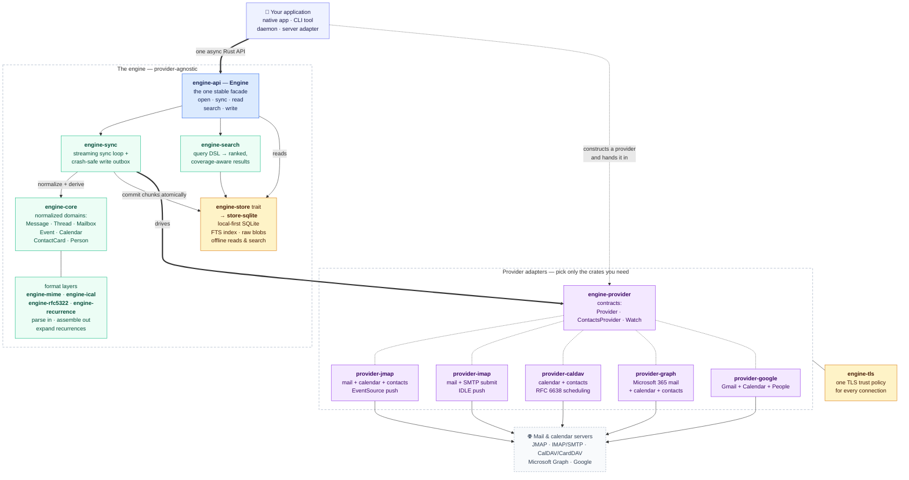
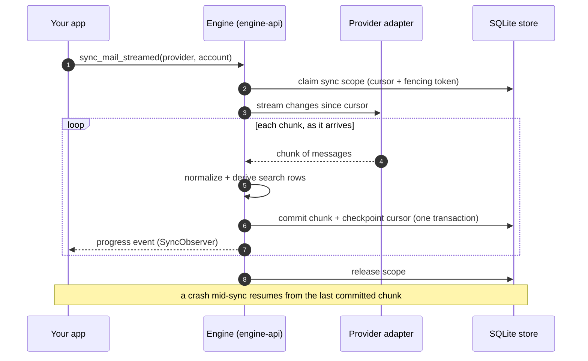
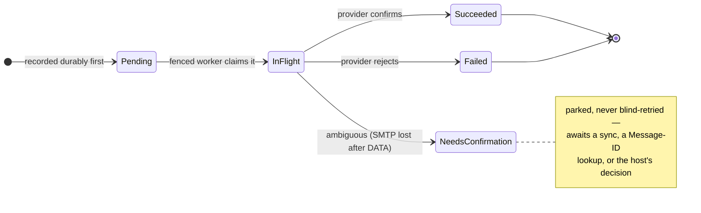

# email-calendar-sync-engine

[](https://github.com/allodia-eu/email-calendar-sync-engine/actions/workflows/ci.yml)
[](https://codecov.io/gh/allodia-eu/email-calendar-sync-engine)


A standalone **Rust engine for personal information management (PIM)**: local-first mail,
calendar, and contact sync, search, indexing, and durable writes. Designed to be embedded by
native apps, command-line tools, local daemons, and server-side adapters.

The engine is **provider-agnostic**: it speaks modern and legacy protocols behind normalized
models, and keeps a local source of truth so the host stays useful offline.

> **Status:** The core domain model, sync orchestration, SQLite store, search/index, MIME body extraction, iCalendar/RFC 5322 handling, iTIP/iMIP scheduling, the unified people index, the shared TLS stack, and all five provider adapters are implemented and tested against real servers. The project is still in early product development, so public APIs may evolve as more hosts and language bindings are integrated.

## What the engine gives a host

- **Normalized mail, calendar, and JSContact-shaped contact models** across JMAP, IMAP/SMTP,
  CalDAV/CardDAV, Google, and Microsoft Graph.
- **Local-first sync** into a SQLite store with full-text search, so reads and search work offline.
- **Durable writes** for mail, events, and source-targeted contacts through a crash-safe outbox.
- **Scheduling that is a first-class verb** — inbound iTIP/iMIP parsing with a trust decision, and
  an RSVP that answers on every calendar transport, telling the host up front which of the
  surrounding controls (a note to the organizer, suppressing the notification) it can honour.
- **A unified people index** across every contact source, plus recipient history for compose
  autocomplete.
- **Streaming sync** that commits chunks as they arrive, so a UI can render recent mail and progress before a full mailbox finishes.
- **Provider-native raw payloads preserved** (MIME, iCalendar, JSCalendar, JSContact, vCard,
  and provider JSON) for lossless re-parsing and writes.
- **Multi-account** by design, with a shared TLS trust policy per host.

At-rest protection is a *construction* detail, not a fork in the contract: the default is plain
SQLite over the host OS's file encryption, and SQLCipher is an opt-in build. The store trait is
encryption-agnostic either way.

## Implemented providers

| Provider | Crate | Mail | Calendar | Contacts | Push |
| --- | --- | --- | --- | --- | --- |
| **JMAP** | `provider-jmap` | read/write/submit | read/write + RSVP | RFC 9610 read/write | EventSource |
| **IMAP + SMTP** | `provider-imap` | read/write/submit (incl. iMIP) | — | — | IDLE |
| **CalDAV + CardDAV** | `provider-caldav` | — | read/write + RSVP | vCard read/write | — |
| **Microsoft Graph** | `provider-graph` | read/write/submit (incl. iMIP) | read/write + RSVP | personal read/write + directories | — |
| **Google** | `provider-google` | read/write/submit (incl. iMIP) | read/write + RSVP | People read/write + directories | — |

Every capability above is advertised at runtime on `ConnectionInfo::capabilities`, so a host asks
what this account can do rather than switching on which provider it is. That includes the parts
that genuinely differ: whether a write carries an **enforced** guard (CalDAV, Graph and Google for
calendars; CalDAV/CardDAV and Google for contacts) or none (JMAP, where no per-object precondition
exists), whether the *server* schedules the iTIP itself, and whether this transport can send an
iMIP message on the host's behalf.

See [`docs/providers.md`](docs/providers.md) for the full provider matrix, RFC/standard details, and per-provider connection examples.

## Quickstart

Add `engine-api` and the provider crates you need to your `Cargo.toml`:

```toml
[dependencies]
engine-api = { path = "crates/engine-api" }
provider-jmap = { path = "crates/provider-jmap" }
provider-imap = { path = "crates/provider-imap" }
engine-tls = { path = "crates/engine-tls" }
tokio = { version = "1", features = ["rt-multi-thread", "macros"] }
```

### Open the engine

```rust
use engine_api::{AccountId, Engine};

#[tokio::main]
async fn main() -> Result<(), Box<dyn std::error::Error>> {
    let engine = Engine::open("engine.sqlite")?;
    let account = AccountId::try_from("alice@example.com")?;
    // ... connect a provider and sync
    Ok(())
}
```

### Connect to a JMAP server

```rust
use engine_tls::TlsClientConfig;
use provider_jmap::{Credentials, JmapConfig, JmapProvider};

// The bundled Mozilla roots (the engine default). For bundled ∪ OS store, custom roots, or
// the platform verifier, build one from a policy: engine_tls::client_config(&TlsPolicy::…)?
let tls = TlsClientConfig::bundled();
let config = JmapConfig::new(
    "https://jmap.example.com",
    Credentials::basic("alice@example.com", "app-password"),
)
.with_tls(tls);

let provider = JmapProvider::connect(config).await?;
```

### Connect to an IMAP server

```rust
use engine_core::ids::MailboxId;
use engine_tls::TlsClientConfig;
use provider_imap::{ImapConfig, ImapProvider};

let tls = TlsClientConfig::bundled();
let config = ImapConfig::new(
    "imap.example.com:993",
    "imap.example.com", // SNI / certificate name
    "alice@example.com",
    "app-password",
);

let provider = ImapProvider::connect(
    &config,
    tls.connector(),
    MailboxId::try_from("INBOX")?,
)
.await?;
```

### Sync mail

```rust
let report = engine.sync_mail(&provider, &account).await?;
println!(
    "mailboxes: {}, messages: {}",
    report.mailboxes.upserted, report.email.upserted
);
```

### Read and search

```rust
let mailboxes = engine.mailboxes(&account).await?;
let messages = engine.messages(&account).await?;
let search = engine
    .search_mail(&account, "subject:report from:alice", 10)
    .await?;
```

### Send mail (JMAP example)

```rust
use engine_api::{Draft, EmailAddress, MessageIdHeader};

let draft = Draft::new(
    MessageIdHeader::new("unique-id@example.com")?,
    EmailAddress::new("alice@example.com"),
    vec![EmailAddress::new("bob@example.com")],
    "Hello",
    "This is the message body.",
);
let outcome = engine.submit_mail(&provider, &account, &draft).await?;
```

### Sync a calendar and answer an invitation

`sync_calendar` materializes occurrences within a horizon — the window the host actually renders —
rather than expanding a recurrence forever. An RSVP is its own verb, guarded by the revision the
event was read at, and reconciles the store before it returns.

```rust
use engine_api::{EventRsvp, Horizon, RsvpResponse, TimeZoneId};

let horizon = Horizon::new(window_start, window_end)?; // UtcDateTime bounds, half-open
let host_zone = TimeZoneId::iana("Europe/Amsterdam")?;
let report = engine
    .sync_calendar(&provider, &account, horizon, &host_zone)
    .await?;

let event = &engine.events(&account).await?[0];
let rsvp = EventRsvp::to(event, "alice@example.com", RsvpResponse::Accepted);
let write = engine
    .rsvp_calendar_event(&provider, &account, "rsvp-1", event, &rsvp)
    .await?;
```

## How the pieces fit

Your application talks to **one type** — `Engine`, from `engine-api` — and hands it the provider
adapter(s) it constructed. Everything below the facade is provider-agnostic: the adapters translate
each protocol into the same normalized model, and everything the engine learns lands in a local
SQLite store, so reads and search keep working offline.



### A sync pass streams — the UI never waits for the whole mailbox

`sync_mail_streamed` commits each chunk in its own transaction and checkpoints the cursor as it
goes, so recent mail renders while the backlog is still arriving — and a crash resumes from the
last committed chunk instead of starting over.



### Writes are durable — recorded locally before any network I/O

Every UI-visible write (send, flag, move, delete, calendar create/update/delete/RSVP, contact
create/patch/delete) becomes a pending op in the store's outbox **first**, then a fenced worker
performs the provider side effect and records the outcome. An ambiguous outcome — an SMTP
connection lost after `DATA` — parks as `NeedsConfirmation` and is never blind-retried, so the
engine cannot double-send mail. The states below are `PendingOpState`, which a host can read back
for any op via `Engine::pending_op_state`.



## Workspace layout

```text
.
├── Cargo.toml                    # virtual workspace + shared lints/deps
├── crates/
│   ├── engine-api/               # Host-facing facade
│   ├── engine-core/              # Domain model, ids, pure logic
│   ├── engine-sync/              # Sync orchestration and outbox
│   ├── engine-provider/          # Provider trait and shared contracts
│   ├── engine-store/             # Store trait
│   ├── store-sqlite/             # SQLite implementation
│   ├── engine-search/            # Query DSL and executor
│   ├── engine-recurrence/        # Recurrence expansion
│   ├── engine-mime/              # Inbound MIME body extraction
│   ├── engine-rfc5322/           # Outbound RFC 5322 / MIME assembly
│   ├── engine-ical/              # iCalendar parse, build, and patch
│   ├── engine-tls/               # Shared TLS trust policy
│   ├── provider-jmap/            # JMAP adapter
│   ├── provider-imap/            # IMAP + SMTP adapter
│   ├── provider-caldav/          # CalDAV + CardDAV adapter
│   ├── provider-graph/           # Microsoft Graph adapter
│   ├── provider-google/          # Gmail + Google Calendar + People adapter
│   ├── engine-cli/               # Headless debugging / fixture harness
│   └── stalwart-harness/         # Docker-based protocol test harness
├── docker/                       # Stalwart and SabreDAV test servers
├── tools/                        # OAuth helpers for the Graph and Google live tests
├── fuzz/                         # cargo-fuzz targets for the hostile-input parsers
├── scripts/ci/                   # The gate CI runs, runnable locally
└── docs/
    ├── providers.md              # User-facing provider guide
    └── agent-guidance/           # Architecture and modeling specs
```

## Building and testing

See [`BUILDING.md`](BUILDING.md) for prerequisites. In short:

```sh
cargo build --workspace --all-features
cargo test --workspace --all-features
```

That suite is fully offline. Every protocol this repo speaks also has a **real** server behind
env-gated live tests — a Dockerized Stalwart (JMAP, IMAP/SMTP, CalDAV/CardDAV) and a SabreDAV
fixture as a second CalDAV implementation via [`docker/`](docker/), plus token-gated suites for
Microsoft Graph and Google. Run the harness with `scripts/ci/stalwart-live.sh`; the offline
provider fakes answer canned bytes regardless of the request, so they cannot catch a wrong
request shape and a provider change is not finished until a real server has accepted it.

The full CI gate (format on nightly, clippy, build, test, docs) is documented in [`AGENTS.md`](AGENTS.md).

## Design and agent documentation

- [`docs/agent-guidance/north-star.md`](docs/agent-guidance/north-star.md) — product goal and architecture
- [`docs/providers.md`](docs/providers.md) — provider capabilities, RFCs, and connection examples
- [`docs/agent-guidance/engine-api.md`](docs/agent-guidance/engine-api.md) — host facade design
- [`docs/agent-guidance/providers.md`](docs/agent-guidance/providers.md) — provider contract
- [`docs/agent-guidance/store-and-sync.md`](docs/agent-guidance/store-and-sync.md) — store and sync model
- [`docs/agent-guidance/calendar-semantics.md`](docs/agent-guidance/calendar-semantics.md) — timezones, recurrence, and iTIP/iMIP scheduling
- [`docs/agent-guidance/contacts.md`](docs/agent-guidance/contacts.md) — contact sources and the people index
- [`docs/agent-guidance/tls.md`](docs/agent-guidance/tls.md) — TLS trust policy
- [`docs/agent-guidance/jmap.md`](docs/agent-guidance/jmap.md), [`imap-smtp.md`](docs/agent-guidance/imap-smtp.md), [`caldav.md`](docs/agent-guidance/caldav.md), [`graph.md`](docs/agent-guidance/graph.md), [`google.md`](docs/agent-guidance/google.md) — per-provider deep dives

## License

[Mozilla Public License 2.0](https://spdx.org/licenses/MPL-2.0.html) — see [`LICENSE`](LICENSE).
`SPDX-License-Identifier: MPL-2.0`

MPL-2.0 is **file-level** copyleft. Changes to the files in this repository must be published under
the same license, so improvements to the engine come back to it — but the engine may be embedded in
a larger work under any license, open or proprietary, and files you add yourself stay yours. That is
what an engine "designed to be embedded by native apps, command-line tools, local daemons, and
server-side adapters" has to allow in order to be worth embedding.

It is also compatible with the GNU GPL and AGPL — MPL-2.0 §1.12 makes them "Secondary Licenses" — so
a copyleft host can use the engine without a license conflict.

**This notice applies to every file in this repository:**

> This Source Code Form is subject to the terms of the Mozilla Public License, v. 2.0. If a copy of
> the MPL was not distributed with this file, You can obtain one at <https://mozilla.org/MPL/2.0/>.

Individual source files deliberately carry no license header. MPL-2.0 Exhibit A allows the notice to
live here instead — *"if it is not possible or desirable to put the notice in a particular file, then
You may include the notice in a location (such as a LICENSE file in a relevant directory) where a
recipient would be likely to look for such a notice."* A file copied out of this repository stays
subject to the license regardless.
