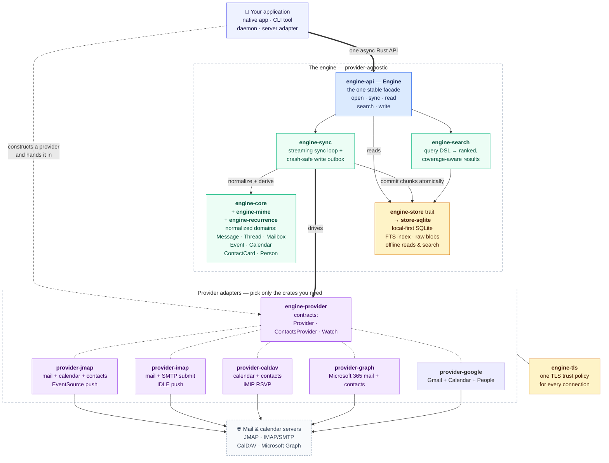
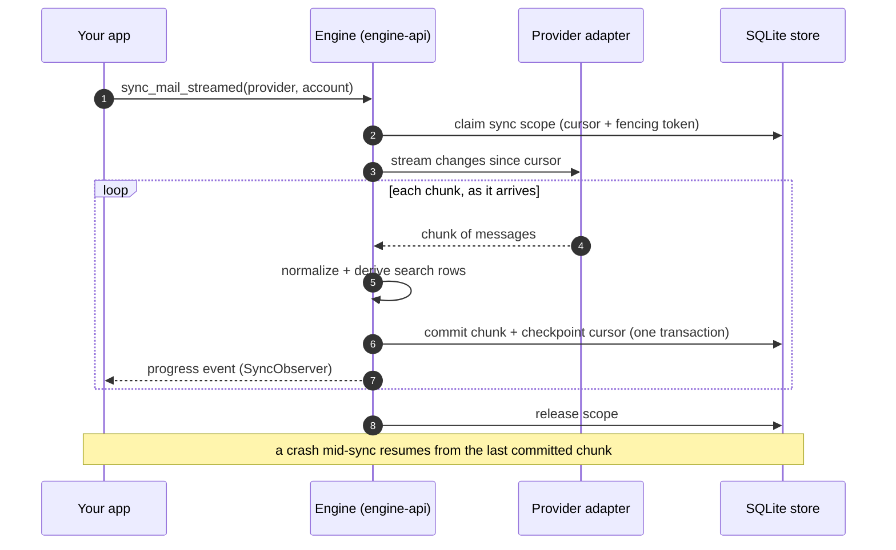
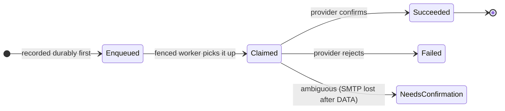

# email-calendar-sync-engine

[](https://github.com/allodia-eu/email-calendar-sync-engine/actions/workflows/ci.yml)
[](https://codecov.io/gh/allodia-eu/email-calendar-sync-engine)


A standalone **Rust engine for personal information management (PIM)**: local-first mail,
calendar, and contact sync, search, indexing, and durable writes. Designed to be embedded by
native apps, command-line tools, local daemons, and server-side adapters.

The engine is **provider-agnostic**: it speaks modern and legacy protocols behind normalized
models, and keeps a local, encrypted source of truth so the host stays useful offline.

> **Status:** The core domain model, sync orchestration, SQLite store, search/index, MIME body extraction, shared TLS stack, and several provider adapters are implemented and tested. The project is still in early product development, so public APIs may evolve as more hosts and language bindings are integrated.

## What the engine gives a host

- **Normalized mail, calendar, and JSContact-shaped contact models** across JMAP, IMAP/SMTP,
  CalDAV/CardDAV, Google, and Microsoft Graph.
- **Local-first sync** into an encrypted SQLite store with full-text search, so reads and search work offline.
- **Durable writes** for mail, events, and source-targeted contacts through a crash-safe outbox.
- **Streaming sync** that commits chunks as they arrive, so a UI can render recent mail and progress before a full mailbox finishes.
- **Provider-native raw payloads preserved** (MIME, iCalendar, JSCalendar, JSContact, vCard,
  and provider JSON) for lossless re-parsing and writes.
- **Multi-account** by design, with a shared TLS trust policy per host.

## Implemented providers

| Provider | Crate | Mail | Calendar | Contacts | Push |
| --- | --- | --- | --- | --- | --- |
| **JMAP** | `provider-jmap` | read/write/submit | read/write | RFC 9610 read/write | EventSource |
| **IMAP + SMTP** | `provider-imap` | read/write/submit | — | — | IDLE |
| **CalDAV + CardDAV** | `provider-caldav` | — | read/write + iMIP RSVP | vCard read/write | — |
| **Microsoft Graph** | `provider-graph` | read | — | personal read/write + directories | — |
| **Google** | `provider-google` | read/write/submit | read/write | People read/write + directories | — |

See [`docs/providers.md`](docs/providers.md) for the full provider matrix, RFC/standard details, and per-provider connection examples.

## Quickstart

Add `engine-api` and the provider crates you need to your `Cargo.toml`:

```toml
[dependencies]
engine-api = { path = "crates/engine-api" }
provider-jmap = { path = "crates/provider-jmap" }
provider-imap = { path = "crates/provider-imap" }
engine-tls = { path = "crates/engine-tls" }
tokio = { version = "1", features = ["rt-multi-thread", "macros"] }
```

### Open the engine

```rust
use engine_api::{AccountId, Engine};

#[tokio::main]
async fn main() -> Result<(), Box<dyn std::error::Error>> {
    let engine = Engine::open("engine.sqlite")?;
    let account = AccountId::try_from("alice@example.com")?;
    // ... connect a provider and sync
    Ok(())
}
```

### Connect to a JMAP server

```rust
use engine_tls::TlsClientConfig;
use provider_jmap::{Credentials, JmapConfig, JmapProvider};

let tls = TlsClientConfig::bundled(); // or bundled_and_system(), system_only(), etc.
let config = JmapConfig::new(
    "https://jmap.example.com",
    Credentials::basic("alice@example.com", "app-password"),
)
.with_tls(tls);

let provider = JmapProvider::connect(config).await?;
```

### Connect to an IMAP server

```rust
use engine_core::ids::MailboxId;
use engine_tls::TlsClientConfig;
use provider_imap::{ImapConfig, ImapProvider};

let tls = TlsClientConfig::bundled();
let config = ImapConfig::new(
    "imap.example.com:993",
    "imap.example.com", // SNI / certificate name
    "alice@example.com",
    "app-password",
);

let provider = ImapProvider::connect(
    &config,
    tls.connector(),
    MailboxId::try_from("INBOX")?,
)
.await?;
```

### Sync mail

```rust
let report = engine.sync_mail(&provider, &account).await?;
println!(
    "mailboxes: {}, messages: {}",
    report.mailboxes.upserted, report.email.upserted
);
```

### Read and search

```rust
let mailboxes = engine.mailboxes(&account).await?;
let messages = engine.messages(&account).await?;
let search = engine
    .search_mail(&account, "subject:report from:alice", 10)
    .await?;
```

### Send mail (JMAP example)

```rust
use engine_api::{Draft, EmailAddress, MessageIdHeader};

let draft = Draft::new(
    MessageIdHeader::new("unique-id@example.com")?,
    EmailAddress::new("alice@example.com"),
    vec![EmailAddress::new("bob@example.com")],
    "Hello",
    "This is the message body.",
);
let outcome = engine.submit_mail(&provider, &account, &draft).await?;
```

## How the pieces fit

Your application talks to **one type** — `Engine`, from `engine-api` — and hands it the provider
adapter(s) it constructed. Everything below the facade is provider-agnostic: the adapters translate
each protocol into the same normalized model, and everything the engine learns lands in a local
SQLite store, so reads and search keep working offline.



### A sync pass streams — the UI never waits for the whole mailbox

`sync_mail_streamed` commits each chunk in its own transaction and checkpoints the cursor as it
goes, so recent mail renders while the backlog is still arriving — and a crash resumes from the
last committed chunk instead of starting over.



### Writes are durable — recorded locally before any network I/O

Every UI-visible write (send, flag, move, delete, calendar create/update/delete) becomes a pending
op in the store's outbox **first**, then a fenced worker performs the provider side effect and
records the outcome. An ambiguous outcome — an SMTP connection lost after `DATA` — parks as
`NeedsConfirmation` and is never blind-retried, so the engine cannot double-send mail.



## Workspace layout

```text
.
├── Cargo.toml                    # virtual workspace + shared lints/deps
├── crates/
│   ├── engine-api/               # Host-facing facade
│   ├── engine-core/              # Domain model, ids, pure logic
│   ├── engine-sync/              # Sync orchestration and outbox
│   ├── engine-provider/          # Provider trait and shared contracts
│   ├── engine-store/             # Store trait
│   ├── store-sqlite/             # SQLite implementation
│   ├── engine-search/            # Query DSL and executor
│   ├── engine-recurrence/        # Recurrence expansion
│   ├── engine-mime/              # MIME / RFC 5322 body extraction
│   ├── engine-tls/               # Shared TLS trust policy
│   ├── provider-jmap/            # JMAP adapter
│   ├── provider-imap/            # IMAP + SMTP adapter
│   ├── provider-caldav/          # CalDAV adapter
│   ├── provider-graph/           # Microsoft Graph adapter
│   ├── engine-cli/               # Headless debugging / fixture harness
│   └── stalwart-harness/         # Docker-based protocol test harness
└── docs/
    ├── providers.md              # User-facing provider guide
    └── agent-guidance/           # Architecture and modeling specs
```

## Building and testing

See [`BUILDING.md`](BUILDING.md) for prerequisites. In short:

```sh
cargo build --workspace --all-features
cargo test --workspace --all-features
```

The full CI gate (format on nightly, clippy, build, test, docs) is documented in [`AGENTS.md`](AGENTS.md).

## Design and agent documentation

- [`docs/agent-guidance/north-star.md`](docs/agent-guidance/north-star.md) — product goal and architecture
- [`docs/providers.md`](docs/providers.md) — provider capabilities, RFCs, and connection examples
- [`docs/agent-guidance/engine-api.md`](docs/agent-guidance/engine-api.md) — host facade design
- [`docs/agent-guidance/providers.md`](docs/agent-guidance/providers.md) — provider contract
- [`docs/agent-guidance/store-and-sync.md`](docs/agent-guidance/store-and-sync.md) — store and sync model
- [`docs/agent-guidance/tls.md`](docs/agent-guidance/tls.md) — TLS trust policy
- [`docs/agent-guidance/jmap.md`](docs/agent-guidance/jmap.md), [`imap-smtp.md`](docs/agent-guidance/imap-smtp.md), [`caldav.md`](docs/agent-guidance/caldav.md), [`graph.md`](docs/agent-guidance/graph.md) — per-provider deep dives

## License

[Mozilla Public License 2.0](https://spdx.org/licenses/MPL-2.0.html) — see [`LICENSE`](LICENSE).
`SPDX-License-Identifier: MPL-2.0`

MPL-2.0 is **file-level** copyleft. Changes to the files in this repository must be published under
the same license, so improvements to the engine come back to it — but the engine may be embedded in
a larger work under any license, open or proprietary, and files you add yourself stay yours. That is
what an engine "designed to be embedded by native apps, command-line tools, local daemons, and
server-side adapters" has to allow in order to be worth embedding.

It is also compatible with the GNU GPL and AGPL — MPL-2.0 §1.12 makes them "Secondary Licenses" — so
a copyleft host can use the engine without a license conflict.
